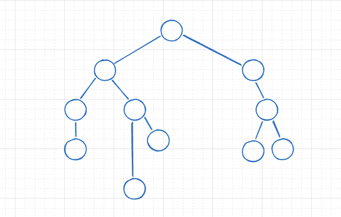

# Context-Aware Chat MVP



A **Flutter + GetX** application that implements a branching conversation model for any LLM API (Gemini, OpenAI, Claude). It maintains a tree-like conversation structure with **context-aware responses**, allowing you to branch, navigate, and maintain multiple conversational paths.

## 🚀 Features

* ✅ **Branching Conversation Tree** (Git-style)
* ✅ **Multi-LLM Support** (Gemini / OpenAI / Claude)
* ✅ **Dynamic Context Generation** (builds context from selected node up to root)
* ✅ **Hive for Persistent Storage**
* ✅ **Graph Visualization** of chat nodes
* ✅ **Drawer Navigation** to switch between nodes
* ✅ **Local Summaries for nodes** (short labels)
* ✅ **Full Context Passing** per node for API calls

## 📱 UI Structure

* **Single Screen Chat Interface**
* **Drawer with GraphView** to visualize conversation flow
* **Long-Press to Branch** any message into a new conversation path
* **Persistent Nodes** stored locally using Hive

## 🔑 Setup

1. Clone repo
2. Add dependencies (`get`, `hive`, `shared_preferences`, `graphview`)
3. Provide your API key in-app
4. Choose provider (Gemini / OpenAI / Claude)

## 🛠️ Architecture

* **ChatController**: Handles node creation, context generation, and API calls
* **ApiService**: Abstracted service for all providers with dynamic context injection
* **ChatNode Model**: Hive-stored conversation node with `id`, `content`, `parentId`, `children`, `isUser`, `timestamp`

## 🔮 Future Enhancements

* 🔜 **Context Compression:** Automatic summarization of older nodes to save tokens
* 🔜 **Merge Branches:** Ability to merge context from different branches into one
* 🔜 **UI Improvements:** Better graph layout and animated transitions
* 🔜 **Cloud Sync:** Store nodes on backend for cross-device usage
* 🔜 **Role-based Context:** Add system prompts and assistant metadata for richer conversations

## 📌 Key Design Decisions

* Context is built dynamically from **current node -> root**.
* Full content is sent (no summaries) for accuracy.
* Branching does not merge to avoid context conflicts (planned as enhancement).

## 📂 Project Structure

```
lib/
 ├── controllers/chat_controller.dart
 ├── models/chat_node.dart
 ├── services/api_service.dart
 ├── ui/chat_screen.dart
 ├── ui/conversation_drawer.dart
```

## 🤝 Contributing

PRs welcome! This MVP is a foundation for a **Git-style AI chat experience**.

