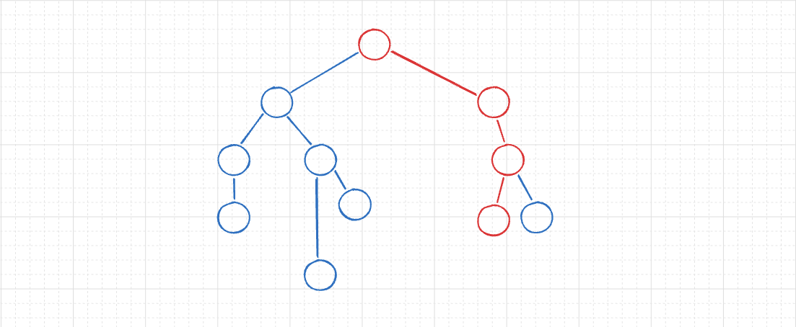

# Branched LLM mvp


# Branched LLM – Context-Efficient Conversational System

A Flutter-based system that replaces linear chat history with a **tree-based branching model**, enabling efficient context reconstruction and multi-threaded LLM conversations.

---

## Problem

Most LLM applications use a **linear message array**, sending the entire conversation with every request.

This leads to:

* Increasing token cost as history grows
* Reduced response relevance due to unrelated context
* No clean way to explore alternate conversation paths

---

## Solution

This project models conversations as a **tree structure instead of a list**.

Each message is a node:

* Supports branching from any point
* Isolates independent conversational paths
* Reconstructs only the relevant context for each request

---

## Core Idea

Instead of sending full history:

**Context = path from current node → root**

This ensures:

* Minimal token usage
* Better contextual relevance
* No cross-branch interference

---

## Example

```
Linear Chat:
A → B → C → D → E   (entire history sent every time)

Branched:
A → B → C
        ↘ D → E

Context for E = A → B → C → D → E
```

---

## Architecture

### Data Model

```dart
ChatNode {
  id
  parentId
  children[]
  content
  isUser
  timestamp
}
```

* Stored locally using Hive

---

### Context Generation

* Traverse from selected node → root
* Reconstruct ordered messages
* Send only this path to the LLM

Avoids:

* redundant context
* unrelated conversation leakage

---

### API Layer

* Unified abstraction for:

  * Gemini
  * OpenAI
  * Claude

* Dynamically injects context per request

---

### State Management

* Managed via `ChatController`
* Handles:

  * node creation
  * branching logic
  * context reconstruction
  * API orchestration

---

## Key Design Decisions

### No Context Merging (for now)

* Avoids conflicting instructions across branches
* Keeps behavior predictable
* Merge strategies require conflict resolution

---

### Full Context (No Summarization)

* Prioritizes accuracy over compression
* Avoids hallucination from lossy summaries

---

### Tree Structure (Not DAG)

* Ensures simple traversal
* Predictable parent-child relationships

---

## Features

* Branch from any message
* Visualize conversation as a graph
* Navigate between branches
* Dynamic context reconstruction
* Multi-LLM support
* Persistent local storage (Hive)

---

## Limitations

* No token compression
* No branch merging
* Local-only storage

---

## Future Work

* Context compression (summarization / sliding window)
* Branch merging strategies
* Cloud sync
* Token usage benchmarking

---

## What This Demonstrates

* Understanding of LLM statelessness
* Context optimization using data structures
* Tradeoffs between accuracy and efficiency
* Multi-provider abstraction design

---

## Setup

1. Add API key (locally)
2. Select provider
3. Start branching conversations

---

## Disclaimer

* Tested primarily with Gemini API
* API keys are never stored or transmitted externally
